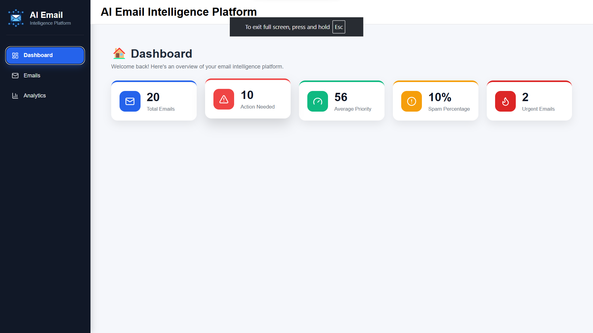
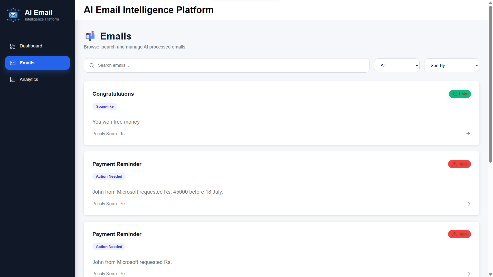
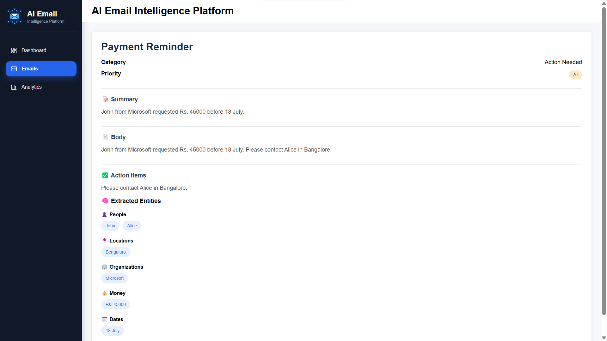
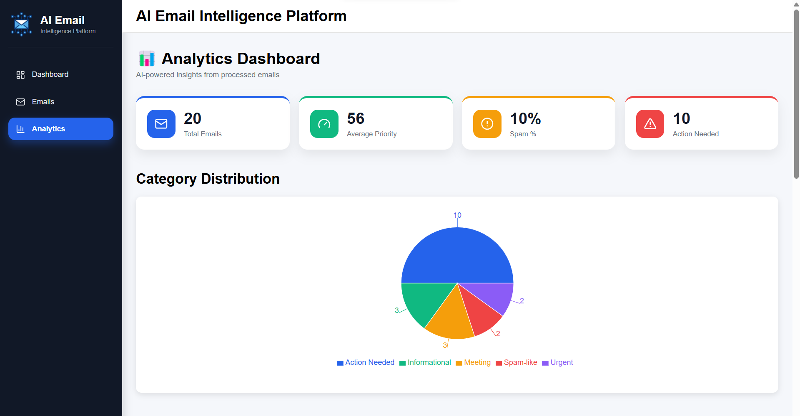
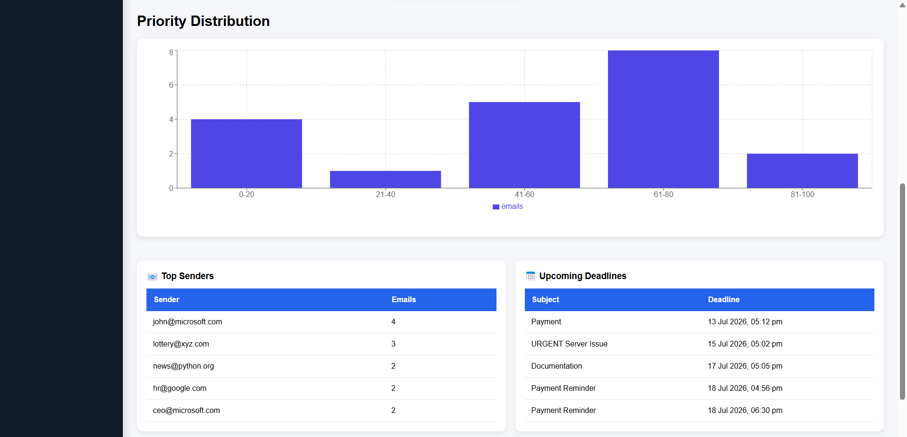
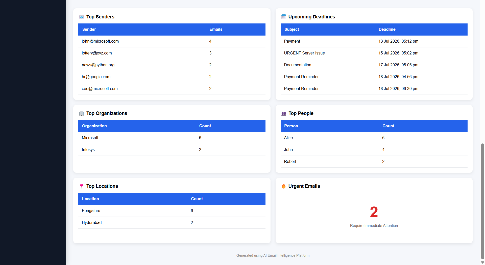

# 📧 AI Email Intelligence Platform

An AI-powered email intelligence platform that automatically classifies incoming emails, scores their priority, summarizes content, extracts key entities, generates context-aware reply suggestions, and surfaces the results through an interactive analytics dashboard — turning a raw inbox into structured, actionable data.

Built with a **React + Flask** architecture and a classical **NLP pipeline** (spaCy, scikit-learn, TF-IDF, rule-based intent detection) rather than an LLM. See [Why Classical NLP Instead of an LLM?](#-why-classical-nlp-instead-of-an-llm) for the reasoning.

---

## Table of Contents

- [Demo](#-demo)
- [Project Status](#-project-status)
- [Features](#-features)
- [System Architecture](#-system-architecture)
- [Database Design](#️-database-design)
- [Tech Stack](#-tech-stack)
- [Why Classical NLP Instead of an LLM?](#-why-classical-nlp-instead-of-an-llm)
- [Project Structure](#-project-structure)
- [Installation & Setup](#-installation--setup)
- [Environment Variables](#-environment-variables)
- [API Documentation](#-api-documentation)
- [Screenshots](#-screenshots)
- [Engineering Highlights](#-engineering-highlights)
- [Future Improvements](#-future-improvements)
- [Author](#-author)

---

## 🎥 Demo

- **Frontend:** _coming soon_
- **Backend API:** _coming soon_

*(Update this section once deployed.)*

---

## 📌 Project Status

🚧 Active Development

**Implemented:**
- Backend REST APIs
- NLP processing pipeline (classification, priority, summary, entities)
- React dashboard
- Email analytics

**Planned:**
- Cloud deployment
- Gmail/Outlook integration
- LLM-based enhancement

---

## 🚀 Features

### Email Intelligence
- Rule/keyword-based intent classification
- Automatic priority scoring
- Spam detection
- Extractive email summarization (TF-IDF)
- Action item extraction
- Deadline identification
- Context-aware reply suggestions

### NLP Capabilities
- **Named Entity Recognition (NER)** via spaCy
  - 👤 People
  - 🏢 Organizations
  - 📍 Locations
  - 📅 Dates
  - 💰 Money
- TF-IDF based email summarization
- Keyword-based intent detection

### Dashboard Analytics
- Total email count
- Category distribution
- Average priority score
- Spam percentage
- Action-required emails
- Entity statistics
- Upcoming deadlines

### Email Management
- Search emails
- Filter by category
- Sort emails
- Pagination
- Email detail view

---

## 🏗 System Architecture

```
React Frontend
      │
      │  Axios REST API
      ▼
Flask Backend API
      │
      ▼
AI Processing Engine
      │
      ├─────────────┬─────────────┬─────────────┐
      ▼             ▼             ▼             ▼
  Intent        Priority      Summary        Entity
Classification   Scoring     Generation    Extraction
      │             │             │             │
      └─────────────┴─────────────┴─────────────┘
                          │
                          ▼
                   SQLite Database
```

---

## 🗄️ Database Design

Processed email intelligence is stored using SQLAlchemy ORM. Each email record includes:

- Sender information
- Subject and content
- Category
- Priority score
- AI-generated summary
- Extracted entities
- Action items
- Deadlines
- Spam classification

---

## 🛠 Tech Stack

**Frontend**
- React
- Vite
- Axios
- React Router
- Recharts
- Lucide React
- CSS

**Backend**
- Python
- Flask
- Flask-SQLAlchemy
- Pydantic
- SQLite

**AI / NLP**
- spaCy
- Scikit-learn
- TF-IDF
- Rule-based NLP techniques

---

## 🧠 Why Classical NLP Instead of an LLM?

The first version of this platform uses classical NLP techniques (spaCy, scikit-learn, TF-IDF, rule-based logic) instead of an external LLM API.

Reasons:
- Zero API dependency
- Faster inference
- Deterministic, reproducible results
- No usage cost
- Easier debugging and testing

The architecture is designed so an LLM-based understanding layer can be added later without a rewrite (see [Future Improvements](#-future-improvements)).

---

## 📁 Project Structure

```
AI_Email_Intelligence_Platform/
│
├── Backend/
│   ├── app/
│   │   ├── ai_engine.py
│   │   ├── models.py
│   │   ├── schemas.py
│   │   └── main.py
│   ├── instance/
│   │   └── email_intelligence.db
│   ├── requirements.txt
│   └── run.py
│
├── Frontend/
│   ├── src/
│   │   ├── components/
│   │   │   ├── Sidebar.jsx
│   │   │   └── StatCard.jsx
│   │   ├── pages/
│   │   │   ├── Dashboard.jsx
│   │   │   ├── Emails.jsx
│   │   │   ├── EmailDetails.jsx
│   │   │   └── Analytics.jsx
│   │   ├── routes/
│   │   │   └── routes.jsx
│   │   ├── styles/
│   │   │   ├── Dashboard.css
│   │   │   ├── Emails.css
│   │   │   ├── EmailDetails.css
│   │   │   ├── Analytics.css
│   │   │   └── SideBar.css
│   │   ├── App.jsx
│   │   ├── main.jsx
│   │   └── index.css
│   ├── package.json
│   └── vite.config.js
│
├── screenshots/
│
└── README.md
```

---

## ⚙️ Installation & Setup

### 1. Clone the Repository

```bash
git clone https://github.com/kavya608/ai-email-intelligence-platform.git
cd ai-email-intelligence-platform
```

### 2. Backend Setup

Navigate to the backend directory:
```bash
cd Backend
```

Create a virtual environment:
```bash
python -m venv venv
```

Activate the environment (Windows):
```bash
venv\Scripts\activate
```

Install dependencies:
```bash
pip install -r requirements.txt
```

Run the Flask server:
```bash
python -m app.main
```

Backend runs on:
```
http://127.0.0.1:5000
```

### 3. Frontend Setup

Navigate to the frontend directory:
```bash
cd Frontend
```

Install packages:
```bash
npm install
```

Start the React application:
```bash
npm run dev
```

Frontend runs on:
```
http://localhost:5173
```

---

## 🔐 Environment Variables

The project currently runs on SQLite by default (`instance/email_intelligence.db`).

Optional `.env` configuration inside `Backend/`:

```
DATABASE_URL=sqlite:///instance/email_intelligence.db
```

---

## 📡 API Documentation

### Ingest Email
**POST**
```
/emails/ingest
```
Adds a new email and processes it using the AI engine.

### Batch Email Processing
**POST**
```
/emails/batch-ingest
```
Processes multiple emails together.

### Get Emails
**GET**
```
/emails/
```
Supports:
- Pagination
- Search
- Filtering
- Sorting

Example:
```
/emails/?page=1&limit=10
```

### Get Email Details
**GET**
```
/emails/<id>
```
Returns complete email intelligence:
- Category
- Priority
- Summary
- Entities
- Action items

**Example Response:**
```json
{
  "category": "Work",
  "priority": 8,
  "summary": "Meeting scheduled for project discussion",
  "entities": {
    "people": ["John"],
    "organizations": ["Google"]
  },
  "action_items": ["Confirm attendance", "Prepare project update"]
}
```

### Generate Reply
**POST**
```
/emails/reply
```
Generates a context-aware reply suggestion based on the email's content and intent.

### Dashboard Statistics
**GET**
```
/dashboard/stats
```
Returns:
- Email statistics
- Category breakdown
- Priority metrics
- Entity insights

---

## 📸 Screenshots

| Dashboard | Emails |
|---|---|
|  |  |

| Email Details |
|---|
|  |

**Analytics**

|  |  |  |
|---|---|---|

---

## 🧩 Engineering Highlights

- Designed REST APIs using Flask
- Implemented a modular AI processing pipeline (classification, priority scoring, summarization, entity extraction)
- Used SQLAlchemy ORM for database management
- Integrated the React frontend with the Flask backend via Axios
- Implemented pagination and filtering for scalable email retrieval
- Built analytics endpoints for dashboard visualization

---

## 🌍 Future Improvements

- 🤖 LLM-based email understanding
- 📧 Gmail API integration
- 📬 Outlook integration
- 🔔 Smart notifications
- 🧠 Advanced AI reply generation
- ☁️ Cloud deployment
- 🔐 User authentication
- 📱 Mobile application

---

## 👩‍💻 Author

**G M Kavya**
Frontend Developer | Full Stack Developer

GitHub: [github.com/kavya608](https://github.com/kavya608)

---

⭐ If you find this project useful, consider giving it a star!
